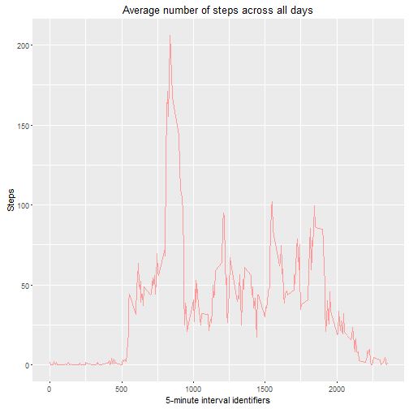
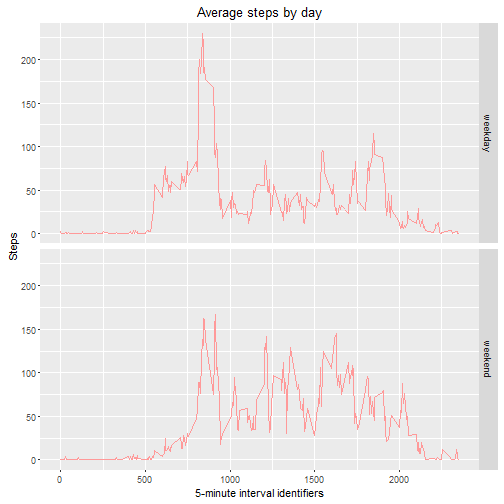

## Loading and preprocessing the data

- Loading the dataset into R

```r
library(plyr)
library(lattice)

if(!file.exists("activity.zip")) {
    url <- "https://d396qusza40orc.cloudfront.net/repdata%2Fdata%2Factivity.zip"
    download.file(url, "activity.zip")
}
data <- read.csv(unz("activity.zip", "activity.csv"), 
                 colClasses = c("integer", "Date", "integer"))
```


## What is mean total number of steps taken per day?

-  The total number of steps taken per day

```r
steps <- aggregate(steps~date, data, sum)
histogram(steps$steps, xlab = "Steps", breaks = 10, 
          main = "The total number of steps taken per day")
```

 


```r
mean.steps <- mean(steps$steps)
median.steps <- median(steps$steps)
options(scipen=999)
```

- The __mean__ total number of steps taken per day: _10766.1886792_.
- The __median__ total number of steps taken per day: _10765_.

## What is the average daily activity pattern?


```r
avg.steps <- aggregate(steps~interval, data, mean)
xyplot(steps ~ interval, data = avg.steps, type = "l", 
       xlab = "5-minute interval identifiers", ylab = "Steps", 
       main = "Average number of steps across all days")
```

 


```r
max.interval <- avg.steps$interval[which.max(avg.steps$steps)]
```
- The 5-minute interval, that contains the __maximum__ average number of steps: _835_.


## Imputing missing values


```r
complete <- complete.cases(data)
missing.val <- sum(!complete)
```
- The total number of rows with NAs: _2304_.

To filling all of the missing values in the dataset, I adopted the strategy: using mean of 5-minute interval


```r
na.index = which(is.na(data$steps))
na.interval = data[na.index, 3]
fill.steps = sapply(na.interval, function(x) { avg.steps[(avg.steps$interval==x), 2]})
data2 <- data
data2[na.index, 'steps'] <- fill.steps
steps2 <- aggregate(steps~date, data2, sum)

histogram(steps2$steps, xlab = "Steps", breaks = 10, 
          main = "The total number of steps taken per day \n (new dataset filled missing data)")
```

 

```r
mean2.steps <- mean(steps2$steps)
median2.steps <- median(steps2$steps)
```

###After filling the missing values

- The __mean__ total number of steps taken per day: _10766.1886792_.
- The __median__ total number of steps taken per day: _10766.1886792_.

The mean number of steps taken per day are the same (_10766.1886792_).
But, the median number of steps taken per day are slightly different (before filling missing data: _10765_, after filling missing data: _10766.1886792_). It is probably due to filling missing values by the mean of 5 minute interval.


## Are there differences in activity patterns between weekdays and weekends?


```r
data2['day'] = factor(ifelse(as.POSIXlt(data2$date)$wday %in% c(0,6), "weekend", "weekday"))

avg2.steps <- aggregate(steps~interval + day, data2, mean)
xyplot(steps ~ interval | day, data = avg2.steps, type='l', layout = c(1, 2), 
       xlab = "Interval", ylab = "Number of steps", main = "Average steps by day")
```

 
